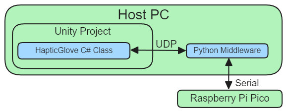

# `kocca2024_glove` repository
resources from implementation of pneumatic glove prototype developed for 2024 KOCCA haptic research project.

Author: Minwoo Lee(minnov13@khu.ac.kr, [HITLab@Kyung Hee University](https://khuhit.netlify.app/))

## Contents
- sample unity project and C# API
- python middleware and its standalone executable
- raspberry pi pico w firmware
- schematic of electronics

## Architecture
